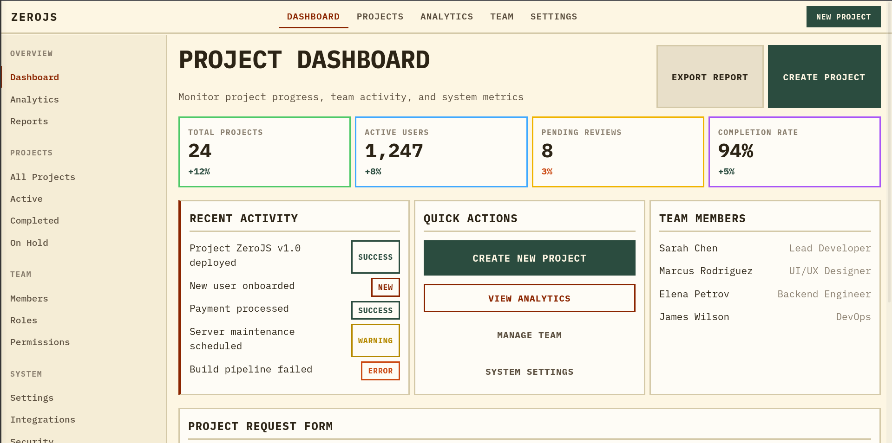
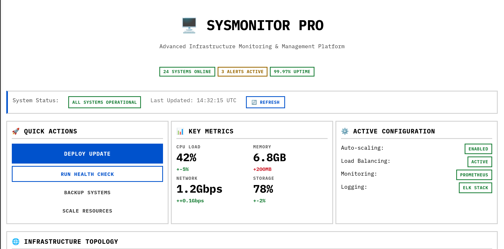

# Zero-JS

I wanted to see if I could make beautiful websites without having to mess around with HTML, CSS, and JavaScript, and also without having to touch any web frameworks with a billion dependencies. That's what this project aims to do.

## Features

- **Header-only** - Just include and use, no compilation needed
- **Component-based architecture** - Build UIs with reusable components
- **Zero dependencies** - Pure C++ to HTML/CSS generation
- **Three built-in themes** - Dark, Light, and Cream
- **Responsive design** - Mobile-friendly layouts
- **Chart components** - SVG-based data visualisation
- **HTMX integration** - Dynamic interactions without JavaScript
- **CMake support** - Easy integration with `find_package()`

## Quick Start

```cpp
#include "zero_js.hpp"
using namespace zero_js;

int main() {
    Page page("My Website");
    page.dark_mode();

    page.add(
        App()
            .navbar(Navbar().brand("MyApp"))
            .add(Card().title("Hello World")
                .add(Text("Welcome to ZeroJS!"))
                .add(Button("Get Started"))
            )
    );

    page.render_to_file("index.html");
    return 0;
}
```

## Themes

ZeroJS supports five built-in themes:

| Theme | Description |
|-------|-------------|
| **Dark** | Terminal-inspired with green accents, perfect for developer tools |
| **Light** | Clean, minimal design with dark accents for professional documentation |
| **Cream** | Warm, paper-like feel great for long-form reading |

```cpp
page.dark_mode();      // Terminal green on black
page.light_mode();     // Clean professional
page.cream_mode();     // Warm paper-like
```

## Examples

- An example dashboard using the technical document style theme


- A diagram using the dark mode theme


- A system monitor page using the light mode theme


See the `examples/` directory for complete static websites:

| Example | Description |
|---------|-------------|
| `dashboard/` | Business metrics dashboard |
| `personal_portfolio/` | Developer portfolio |
| `habit_tracker/` | Goal tracking app |
| `system_monitor/` | Infrastructure monitoring with charts |
| `chart_demo/` | Chart component showcase |
| `doc_website/` | Documentation website |

## Installation

### Option 1: Header-only (simplest)

Just copy `zero_js.hpp` and the `src/` directory into your project:

```cpp
#include "zero_js.hpp"
```

### Option 2: CMake (recommended)

**Build and install:**

```bash
mkdir build && cd build
cmake ..
cmake --build .
sudo cmake --install .
```

**Use in your project:**

```cmake
cmake_minimum_required(VERSION 3.14)
project(MyApp)

find_package(ZeroJS REQUIRED)

add_executable(myapp main.cpp)
target_link_libraries(myapp PRIVATE ZeroJS::ZeroJS)
```

### Option 3: CMake subdirectory

Add ZeroJS as a subdirectory in your project:

```cmake
add_subdirectory(zero-js)
target_link_libraries(myapp PRIVATE ZeroJS::ZeroJS)
```

## Building Examples

**Using the build script:**

```bash
./build_examples.sh
```

**Using CMake:**

```bash
mkdir build && cd build
cmake ..
cmake --build .
```

**Manual compilation:**

```bash
g++ -std=c++17 -I. examples/dashboard/dashboard.cpp -o dashboard
./dashboard
```

This generates HTML files that you can open in any browser.

## Architecture

```
zero-js/
├── zero_js.hpp          # Main header to include
├── src/
│   ├── components.hpp   # UI component definitions
│   ├── charts.hpp       # Chart component implementations
│   ├── styles.hpp       # CSS generation and theming
│   ├── renderer.hpp     # HTML output generation
│   └── htmx.hpp         # HTMX integration
├── examples/            # Example applications
└── cmake/               # CMake package configuration
```

## Components

### Layout
- `App` - Application wrapper with navbar and sidebar
- `Page` - Root page component
- `Grid` - CSS grid layout (2, 3, or 4 columns)
- `Row` / `Column` - Flexbox containers
- `Card` - Content cards with optional titles
- `Navbar` / `Sidebar` - Navigation components

### Display
- `Text` - Paragraphs and headings (h1, h2, h3)
- `Badge` - Status badges (success, warning, error)
- `Stat` - Metric display with change indicators
- `Image` - Responsive images
- `Divider` / `Spacer` - Layout utilities

### Interactive
- `Button` - Primary, secondary, outline, ghost variants
- `Input` - Form inputs with labels
- `Form` - Form container with HTMX support
- `Link` - Styled hyperlinks

### Charts
- `LineChart` - Line/area charts
- `BarChart` - Bar charts

## Requirements

- C++17 compatible compiler
- CMake 3.14+ (optional, for CMake builds)


